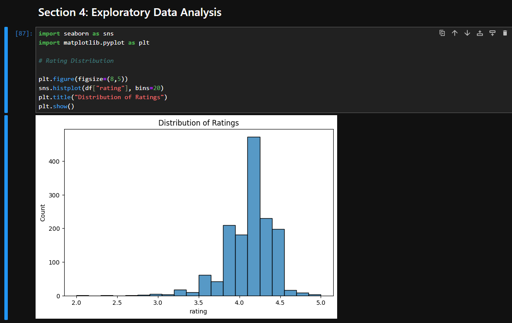
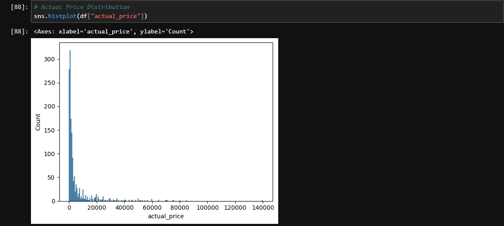
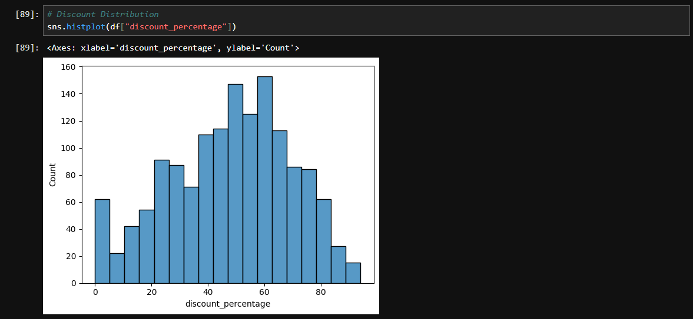
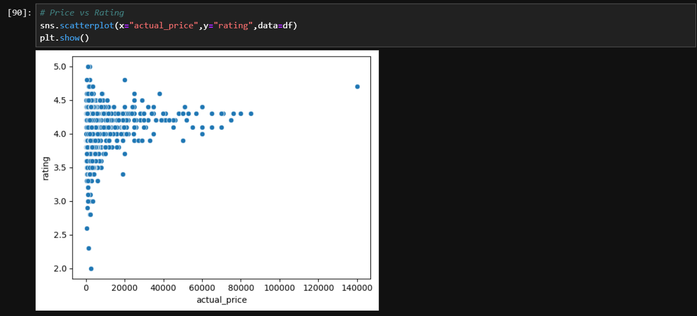
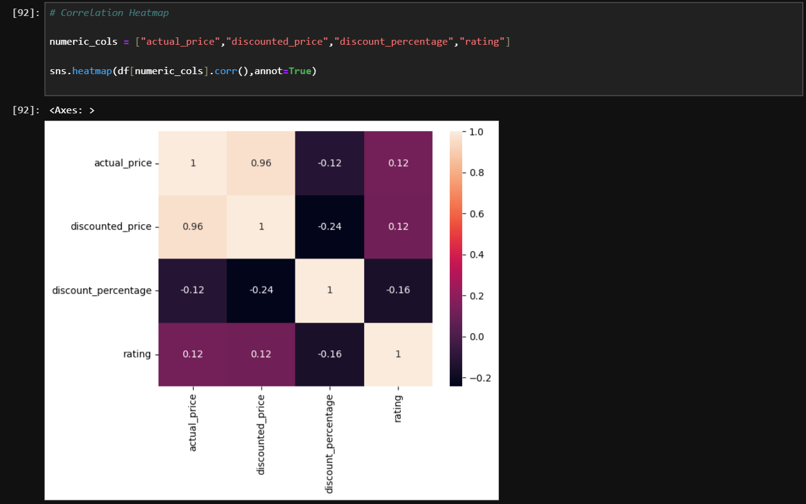
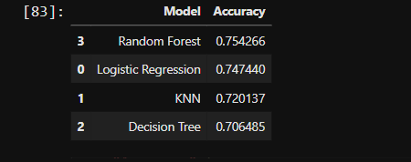

<!-- HEADER -->
<div align="left">

# Amazon Product Rating Analysis

</div>


<div align="center">
  


</div>

---

## 📖 Project Overview

This project explores Amazon product data to understand how pricing, discounts, and other factors influence customer ratings.

The workflow includes:

- Data Cleaning & Preprocessing
- Exploratory Data Analysis (EDA)
- Feature Engineering
- Machine Learning Model Development
- Model Evaluation & Comparison
- Business Insights Extraction

The primary objective is to predict whether a product is likely to receive a **high rating** based on pricing-related features.

---

## 🎯 Objectives

- Analyze Amazon product pricing trends.
- Explore discount patterns across products.
- Identify relationships between pricing and ratings.
- Engineer meaningful predictive features.
- Compare multiple Machine Learning algorithms.
- Predict high-rated products using supervised learning.

---

## 🛠️ Technologies Used

| Category | Tools |
|-----------|--------|
| Programming | Python |
| Data Processing | Pandas, NumPy |
| Visualization | Matplotlib, Seaborn |
| Machine Learning | Scikit-Learn |
| Development | Jupyter Notebook |
| Version Control | Git & GitHub |

---

## 📂 Project Structure

```text
amazon-product-analysis/
│
├── dataset/
│   └── amazon.csv
│
├── notebook/
│   └── amazon_DA.ipynb
│
├── screenshots/
│   ├── 01_project_overview.png
│   ├── 02_dataset_preview.png
│   ├── 03_data_cleaning_summary.png
│   ├── 04_datset_info.png
│   ├── 05_rating_distribution_graph.png
│   ├── 06_price_distribution.png
│   ├── 07_discount_distribution.png
│   ├── 08_price_vs_rating_analysis.png
│   ├── 09_correlation_heatmap.png
│   ├── 10_model_comparison.png
│   ├── 11_feature_importance.png
│   └── 12_confusion_matrix.png
│
├── report
│   └──analysis_report.pdf
│
└── README.md
```

---

## 🧹 Data Preparation

The dataset underwent multiple preprocessing steps:

- Missing value inspection
- Data type conversion
- Currency symbol removal
- Percentage formatting cleanup
- Numerical feature extraction
- Data validation

This ensured consistent and reliable inputs for analysis and model training.

---

## 📊 Exploratory Data Analysis

### Rating Distribution



---

### Product Price Distribution



---

### Discount Distribution



---

### Price vs Rating Analysis



---

### Correlation Heatmap



---

## ⚙️ Feature Engineering

Additional features were created to improve model performance:

| Feature | Description |
|----------|-------------|
| Savings | Actual Price − Discounted Price |
| Price Ratio | Discounted Price / Actual Price |
| High Rating | Binary target variable |

These features helped capture pricing behavior more effectively.

---

## 🤖 Machine Learning Models

The following classification models were trained and evaluated:

- Logistic Regression
- K-Nearest Neighbors (KNN)
- Decision Tree Classifier
- Random Forest Classifier

---

## 📈 Model Performance Comparison



The models were evaluated using accuracy scores to identify the best-performing approach.


## 🔍 Key Insights

- Most Amazon products maintain ratings above 4.0.
- Large discounts do not always lead to higher ratings.
- Product price has a relatively weak correlation with ratings.
- Pricing-derived features contribute significantly to prediction accuracy.
- Ensemble methods demonstrated stronger predictive performance compared to simpler models.

---

## 🚀 Future Improvements

- Incorporate Natural Language Processing (NLP) on customer reviews.
- Perform sentiment analysis.
- Build a recommendation engine.
- Deploy the model using Streamlit.
- Integrate larger real-world e-commerce datasets.

---


## 👨‍💻 Author

**Rushit Tholiya**


---

